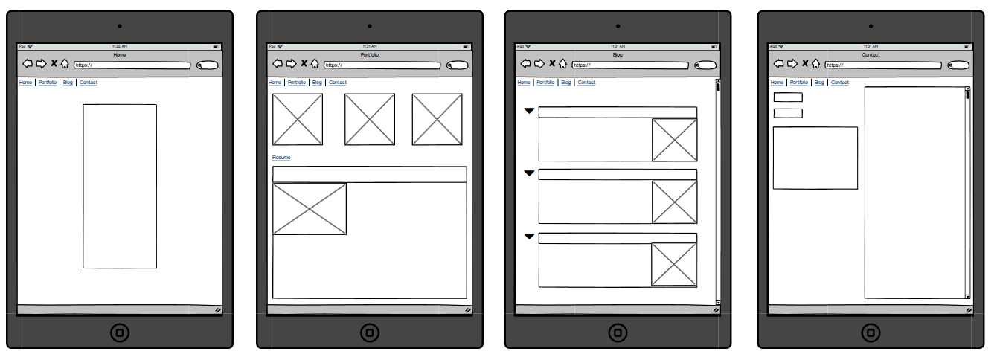

# Purpose

The main purpose of this site is to act as a sigle location to storage provide access to past, present and future projects.  This site function as a display of achievements and as a resume to show to prospective employers.  I have and will also use this site in the future as a playground for learning HTML, CSS and JS as well as other potential skills.

# Functionality & Features

The main features of this site are the four main pages, Home, Portfolio, Blogs and Contact.

These pages serve the following functionality:

Home:  This is a welcoming page for visitors and provides a brief introduction of myself.

Porfolio:  This page has links to projects that I am working on or that I have worked on to showcase my abilities.  My resume is also linked to this page.

Blogs:  This branch of my site is where I can post about topics that are both related and unrelated to my work.  It serves as a more indepth dive into me as a person.

Contact:  Linked to this page is my contact details aas well as form to submit queries to me.

# Diagrams

# Target Audience

This site is mainly targetted at prosepective employers, however there is a wider range of potential interested parties through the use of the blog and contact me sections of the site.

## Links

Git Repository
https://github.com/Hugh-Charlton/Portfolio_Assignment.git